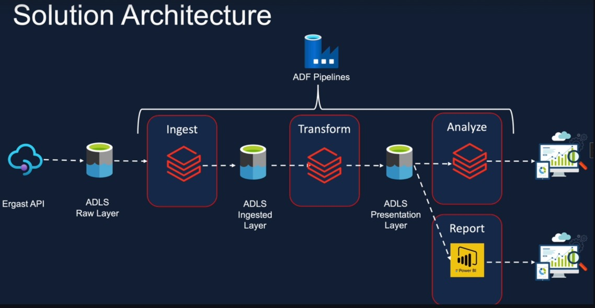
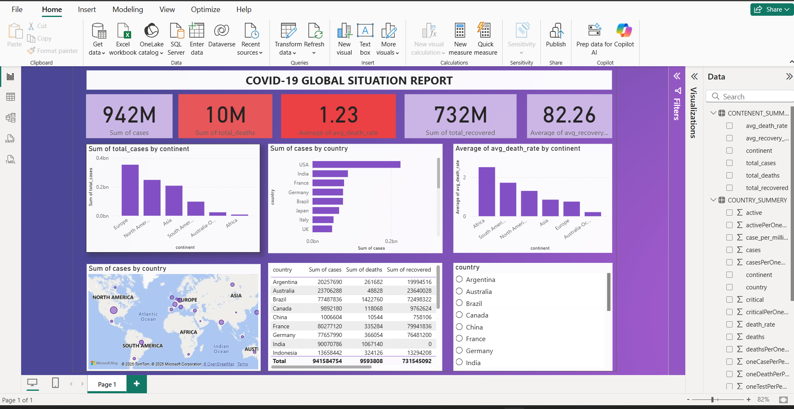

# -End-to-End-Azure-Data-Engineering-Pipeline

🦠 COVID-19 Azure Data Engineering Pipeline
🚀 End-to-End Data Engineering Project using Azure Databricks, ADLS, ADF, and Power BI
This project demonstrates a fully automated data pipeline built on Microsoft Azure. It extracts global COVID-19 data from a public API, processes it using Databricks and PySpark, stores the data in Azure Data Lake Storage (ADLS), and visualizes insights using Power BI.

🧩 Architecture Overview

Workflow:

This Databricks project builds an end-to-end data pipeline that ingests global COVID-19 data from a public API and processes it through three layers:

Raw Layer: Extracts all countries’ data from the API and stores it in Azure Blob Storage.

Ingested Layer: Cleans and filters data for selected countries.

Presentation Layer: Calculates key KPIs (death rate, recovery rate, cases per million) and aggregates results by continent.

The entire workflow can be automated using Databricks Jobs or Azure Data Factory for scheduled refreshes.

🧱 Data Lake Layers / (ADLS)

#├── Raw/
     └── covid_raw.json

#├── Ingested/
     └── covid_ingested.parquet

#└── Presentation/
    ├── country_summary.parquet
    └── continent_summary.parquet

🛠️ Tech Stack
Layer	Technology	Description
Source	Disease.sh API	Real-time COVID-19 country-wise data
Storage	Azure Data Lake Storage Gen2	Multi-layered storage (Raw, Ingested, Presentation)
Processing	Azure Databricks (PySpark)	ETL and transformation logic
Orchestration	Azure Data Factory / Databricks Job	Automated daily runs
Visualization	Power BI	KPI dashboard and global insights

⚙️ Automation
Component	Purpose
Databricks Jobs	Schedules notebooks daily / hourly
ADF Pipelines	Triggers Databricks notebooks sequentially
Power BI Scheduled Refresh	Keeps dashboard updated automatically

📊 Power BI Dashboard

🧠 COVID-19 Global Situation Report

KPIs Displayed:

🌍 Total Cases

💀 Total Deaths

📉 Average Death Rate

💚 Total Recovered

💪 Average Recovery Rate

Visuals:

Bar chart of total cases by continent

Bar chart of average death rate by continent

Country-wise table summary

Map visualization of global spread

